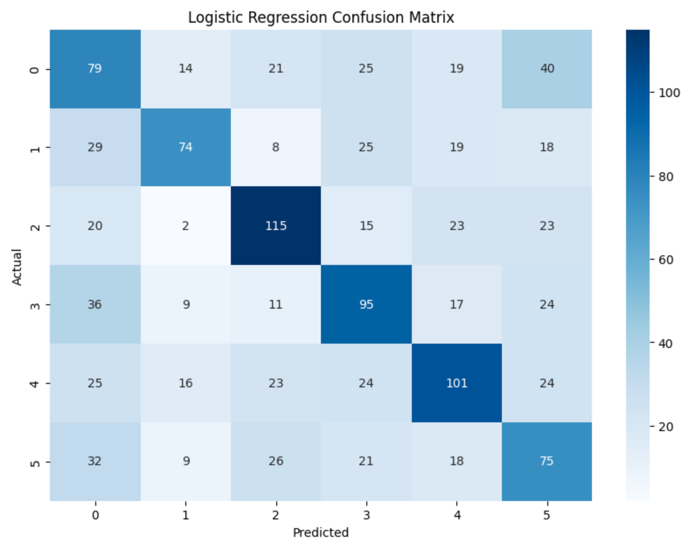
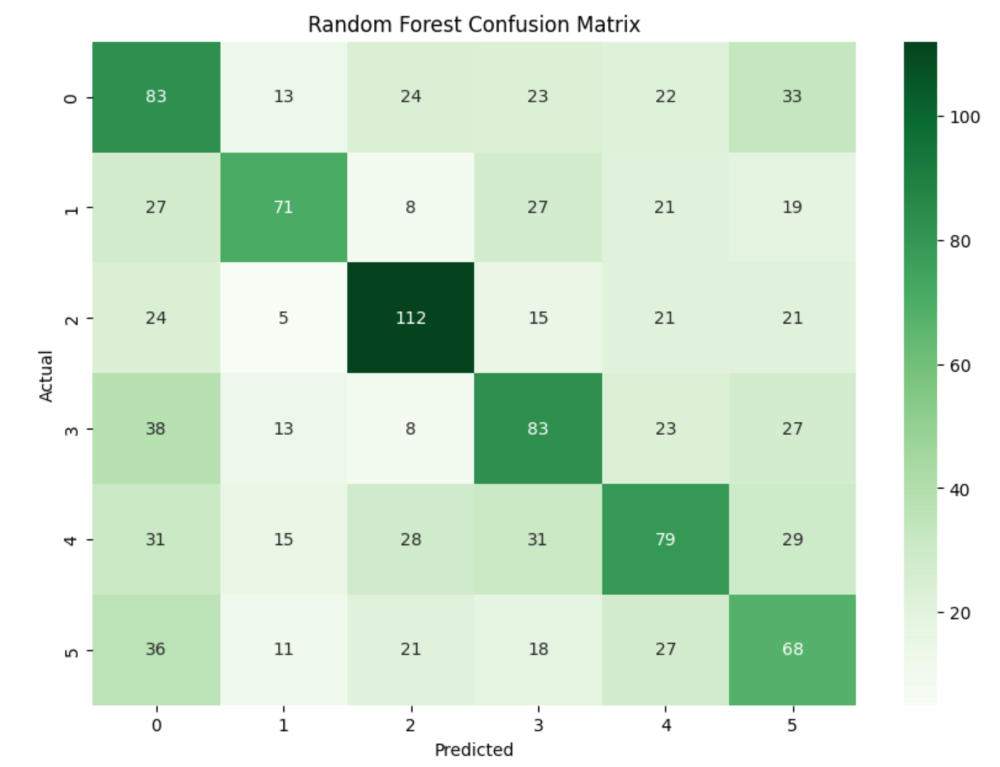

# Automated News Classification with NLP

- Python
- NLTK 3.5
- Scikit-learn 0.24.2
- License: MIT

## About the Project

In an era of information overload, organizing news efficiently is crucial. This project automates the classification of Spanish-language news articles using Natural Language Processing (NLP) and Machine Learning. By implementing text preprocessing, vectorization, and classification models, the system categorizes articles into six key areas: Culture, Sports, Economy, Spain, International, and Society.
This approach could be applied in media platforms, content recommendation systems, or editorial workflows to streamline content organization and improve user experience.

## Key Features

- Advanced text preprocessing: tokenization, stopword removal, and stemming
- Text vectorization using TF-IDF
- Implementation of two classification models: Logistic Regression and Random Forest
- Detailed model evaluation with precision, recall, and F1-score metrics
- Results visualization through confusion matrices

## Why It Matters

Classifying news articles automatically is not only a technical challenge — it directly impacts user experience and editorial efficiency. Accurate classification allows media platforms to:

- Recommend more relevant content to users, enhancing their experience.
- Streamline internal workflows by automatically tagging and categorizing articles.
- Gain insights into content distribution across different categories over time.

**This project bridges NLP techniques and practical content strategy, showing how language technology can enhance real-world communication.**

## Dataset

The dataset used in this project was obtained through the free version of NewsAPI and is hosted on GitHub

- **Data source**: NewsAPI (free version)
- **dataset location**: [GitHub Repository](https://github.com/BeaEsparcia/Clasificacion_Noticias)

## Technologies Used

- Python 3.7+
- Pandas: for data manipulation
- NLTK: for natural language processing
- Scikit-learn: for modeling and evaluation
- Seaborn y Matplotlib: for results visualization

## Installation and Usage

1. Clone the repository:
2. git clone https://github.com/BeaEsparcia/Spanish_News_Classification.git
3. cd Spanish_News_Classification
4. Run the Jupyter notebook: Spanish_News_Classification.ipynb

## Methodology

### Text Preprocessing
1. Conversion to lowercase
2. Punctuation removal
3. Tokenization
4. Stopword removal for Spanish
5. Stemming using SnowballStemmer for Spanish

### Vectorization
- Using the TF-IDF Vectorizer to convert text into numerical features

### Classification Models
- **Logistic Regression**: an efficient linear model for classification problems.
- **Random Forest Classifier**: a decision tree-based model that improves accuracy by combining multiple trees.

## Model Evaluation

The models were evaluated using the following metrics:

- **Accuracy:** Measures the percentage of correct predictions out of the total predictions.
- **Precision:** Measures the proportion of true positives among all predicted positives.
- **Recall:** Measures the proportion of true positives among all actual positives.
- **F1-Score:** Measures the balance between precision and recall.
- **Confusion Matrix:** Provides a detailed view of true positives, false positives, true negatives, and false negatives for each category.

## Results

### Confusion Matrix - Logistic Regression

### Confusion Matrix - Random Forest

## Conclusions and Areas for Improvement: 

The news classification model showed acceptable performance, with room for improvement. Some potential areas for future development include:

1. Expanding the dataset with more news sources
2. Experimenting with more advanced models such as neural networks
3. Conducting a deeper analysis of the key features for classification

## What I Learned 

This project allowed me to deepen my understanding of text preprocessing for Spanish-language data, which presents unique challenges compared to English datasets.
Working with imbalanced categories and noisy real-world data gave me a clearer perspective on the importance of data quality and iterative model tuning.
Additionally, the project strengthened my ability to evaluate models beyond accuracy, using more nuanced metrics like precision, recall, and F1-score.

Finally, this project reaffirmed my passion for NLP applied to real-world content management problems, bridging technology, language, and user experience — exactly the type of challenges I want to work on in my career.

## Contributions

Contributions are welcome. Please open an issue first to discuss any changes you'd like to make.

## License

This project is licensed under the MIT License. See the LICENSE file for more details.

## Contact

[Bea Esparcia] - [esparcia.beatriz@gmail.com] - [www.linkedin.com/in/beaesparcia]

   

  

